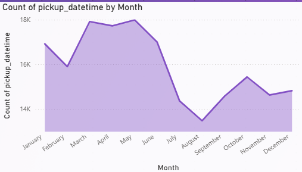

 <html>
<body>
<a href="https://colab.research.google.com/drive/1L6EUlEwzX-6mc6YbqK7XBb0N0LYo0Bm4" target="_blank">
  
</a>
 
# Uber-Fares-Dataset-Analysis-using-Power-BI
## 🚕 Project Overview
This project explores the Uber Fares Dataset using Power BI to extract meaningful insights about fare distribution, ride patterns, and operational performance. The dataset was cleaned and enhanced in Python, followed by interactive data visualization and dashboard development in Power BI.

## 🎯 Project Objectives
- To analyze Uber fare patterns,ride durations, and temporal trends
- To create new analytical features (e.g., hour, day, time categories)
- To develop an interactive Power BI dashboard showing:
  
### 💵 Fare distribution
 1. histograms
 2. box plots
### 🚗 Ride patterns 
 1. Hourly
 2. Daily
 3. Monthly
    
### 🌦️ Seasonal and 🌍 geographic trends
- To highlight busiest periods and, if possible, assess weather impact
- To deliver actionable business insights through data storytelling

## Methodology:

#### 🗃️ 1. Data Collection
- Downloaded Uber Fares dataset from Kaggle
- Included:
   - fare amount
   - pickup time
   - geolocations

#### 🧹 2. Data Cleaning (Python)
- Used Pandas to load and inspect data
  ```python
  from google.colab import drive
  drive.mount('/content/drive')
  import pandas as pd
  uber_df = pd.read_csv('drive/MyDrive/archives/uber.csv', low_memory=False)
  # Check column data types
  uber_df.dtypes
  # Data set Structure
  uber_df.head()
  # Check the structure (columns, data types, non-null counts)
  uber_df.info()
  # Check the shape (rows, columns)
  uber_df.shape
  uber_df.describe()


- Removed missing, duplicate, and outlier records
 ```python
   # Check for missing values
   uber_df.isnull()
   uber_df.isnull().sum()
  # Check for duplicate rows
  print("Duplicate Rows:", uber_df.duplicated().sum())
  uber_df.duplicated()
  # Drop rows with any missing values 
  df = uber_df.dropna(axis=0)
 ```


- Exported cleaned CSV for analysis in Power BI
  ```python
  # Save cleaned dataset
  from google.colab import files
  uber_df.to_csv('uber.csv', index=False)
  files.download('uber.csv')
  ```

#### 🧠 3. Feature Engineering
- Extracted hour, day, month, weekday
  ```python
  import pandas as pd
  import matplotlib.pyplot as plt
  import seaborn as sns
  
  # Ensure pickup_datetime is in datetime format (with timezone awareness removed or converted)
  uber_df['pickup_datetime'] = pd.to_datetime(uber_df['pickup_datetime'], utc=True)
  uber_df['pickup_datetime'] = uber_df['pickup_datetime'].dt.tz_convert(None)  # Convert to naive datetime if needed
  
  # Extract hour from pickup time
  uber_df['hour'] = uber_df['pickup_datetime'].dt.hour
  
  # Optional: Filter unrealistic fare amounts
  uber_df = uber_df[(uber_df['fare_amount'] > 0) & (uber_df['fare_amount'] < 200)]
  
  # Plot average fare by hour
  plt.figure(figsize=(10, 6))
  sns.lineplot(x='hour', y='fare_amount', data=uber_df, estimator='mean', ci=None, marker='o')
  plt.title('Average Fare Amount by Time of Day')
  plt.xlabel('Hour of Day (0 = Midnight)')
  plt.ylabel('Average Fare Amount ($)')
  plt.grid(True)
  plt.tight_layout()
  plt.show()
  ```
- Created time periods (Peak/Off-Peak), ride distance, and duration
  ```python
  import pandas as pd
  # Ensure datetime is parsed correctly (timezone-aware then convert to naive if needed)
  uber_df['pickup_datetime'] = pd.to_datetime(uber_df['pickup_datetime'], utc=True)
  uber_df['pickup_datetime'] = uber_df['pickup_datetime'].dt.tz_convert(None)
  
  # Create new features from datetime
  uber_df['hour'] = uber_df['pickup_datetime'].dt.hour
  uber_df['day'] = uber_df['pickup_datetime'].dt.day
  uber_df['month'] = uber_df['pickup_datetime'].dt.month
  uber_df['day_of_week'] = uber_df['pickup_datetime'].dt.day_name()  # e.g., Monday, Tuesday
  
  # Peak/Off-peak indicator
  # Let's assume peak hours are 7-9 AM and 4-7 PM
  def get_peak_hour(hour):
      if 7 <= hour <= 9 or 16 <= hour <= 19:
          return 'Peak'
      else:
          return 'Off-Peak'
  
  uber_df['time_period'] = uber_df['hour'].apply(get_peak_hour)
    ```

#### 📊 4. Power BI Analysis
- Imported dataset into Power BI Desktop
  

- Built interactive visuals
- DAX formulas used
   - Count
   - Sum
   - Average
   - Variance
   - Standard Variation
     
####  Fare trends <br>
##### Fare Amount by Hour
   
##### Average Fair Amount by Year
   
####  Maps <br>
##### Latitudes and Longitudes
   
####  Time series <br>
##### Pick up Date Time by Hour
   
##### Sum of Hour by Year
   
##### Pick up Date Time by Day
   
##### Pick up Date time by Month
   
#### Added slicers, filters, and drill-down capabilities
##### Slicers(Interactive Filters)
   

## Analysis

### 📊 Analysis: Detailed Findings & Statistical Insights

#### 🚗 1. Fare Distribution
- Most fares fall between $5–$20
- Box plot revealed outliers above $100, likely long-distance or airport trips
- Peak hour fares tend to be slightly higher due to demand

#### ⏰ 2. Time-Based Ride Patterns
- Busiest hours: 7–9 AM and 5–7 PM (commute hours)
- Highest ride count on Fridays and Saturdays
- Monthly trends show increased activity during summer months

#### 📍 3. Geographic Trends
- Ride pickups are concentrated in central NYC
- Hotspots include Midtown Manhattan and Lower Manhattan
- Map visualization shows higher fares around airports and business districts

#### 📈 4. Correlations & Metrics
- Positive correlation between fare amount and distance
- Longer ride durations generally result in higher fares
- Average fare per km stays consistent but slightly rises during peak hours

## Key Results:
### Key Discoveries and Pattern Identification
#### Peak Ride Hours
 - Highest ride volumes occur during morning (7–9 AM) and evening (5–7 PM) commute times.
#### Weekly Trends
 - Fridays and Saturdays show the most Uber activity, indicating weekend demand.
#### Fare Patterns
 - Most fares are between $5 and $20, with a few outliers above $100 from longer trips.
#### Geographic Hotspots
 - Frequent pickups in Midtown and Lower Manhattan; high fares near airport areas.
#### Distance vs Fare
 - Clear positive correlation between ride distance and fare amount.
#### Seasonal Variation
 - Increased ride activity during summer months, suggesting seasonal travel trends.
#### Peak vs Off-Peak Impact
 - Average fares are slightly higher during peak hours due to higher demand.

## Conclusion

### Summary of Main Findings
- Uber rides show clear peak usage during morning and evening commute hours.
- Weekends, especially Fridays and Saturdays, record the highest ride volumes.
- The majority of fares are affordable, ranging between $5 and $20, with a few high-value outliers.
- Ride density is highest in central NYC, particularly Midtown and Lower Manhattan.
- Airport-related trips tend to have higher fares and longer distances.
- There is a strong correlation between fare amount and distance traveled.
- Seasonal patterns indicate increased ride demand during summer months.
- Peak time rides are associated with slightly higher average fares, reflecting surge pricing or demand pressure.

## Recommendations

### Recommendations: Data-Driven Business Suggestions
#### Optimize Driver Availability During Peak Hours
- Increase driver coverage between 7–9 AM and 5–7 PM to meet demand and reduce wait times.
  
#### Weekend Promotions
- Launch targeted discounts or ride bundles on Fridays and Saturdays to capitalize on high ride volumes.
  
#### Airport Zone Pricing Strategy
- Adjust pricing models or introduce flat-rate fares for airport routes to increase transparency and rider trust.
  
#### Focus on Hotspot Coverage
- Allocate more drivers in Midtown and Lower Manhattan, where demand is consistently high.
  
#### Monitor Seasonal Demand
- Prepare for increased activity during summer months by offering seasonal incentives for drivers.
  
#### Refine Fare Strategy During Off-Peak Times
- Introduce off-peak ride discounts to stimulate usage during lower-demand periods.
  
#### Use Distance-Fare Insights to Improve Estimations
- Enhance fare estimation algorithms using fare-per-km analysis to better inform customers.

## License

[](https://opensource.org/licenses/MIT)

This project is licensed under the MIT License - see the [LICENSE](LICENSE) file for details.

</body>
</html>
